以下是对中国马克思主义理论发展脉络的系统性梳理，通过知识图谱形式展现各理论体系的继承关系与核心创新点：

### 中国化马克思主义理论体系演进图谱

#### Ⅰ. **毛泽东思想体系（1945-1978）**
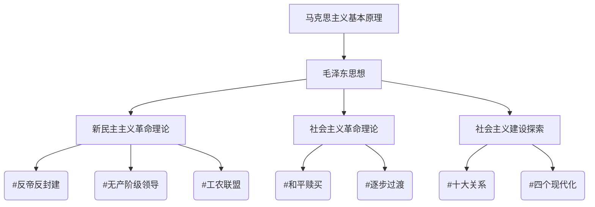

**关键创新**：
- 实现马克思主义中国化第一次飞跃
- 形成"活的灵魂"三要素： #实事求是 #群众路线 #独立自主
- 确立工业化发展路径（1949年工业占比仅10%，1978年达47%）

---

#### Ⅱ. **邓小平理论体系（1978-2002）**
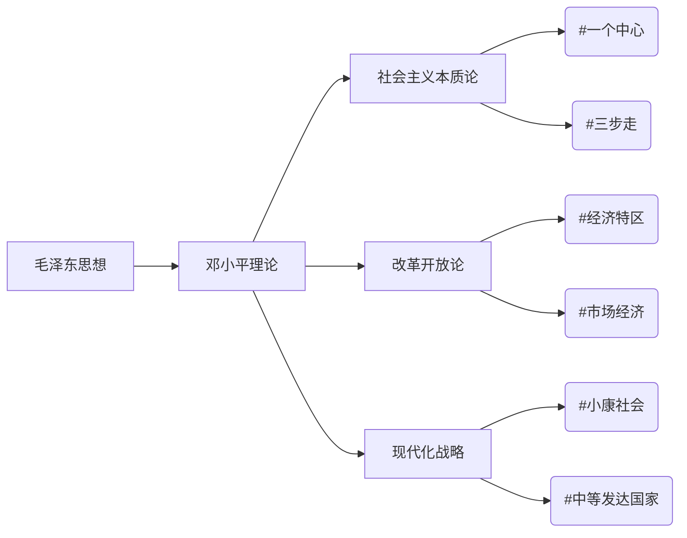

**实践突破**：
- 1984年确立商品经济地位
- 1992年南方谈话破除"姓资姓社"争论
- 2001年GDP突破10万亿元（1978年0.36万亿元）

---

#### Ⅲ. **科学发展观（2003-2012）**
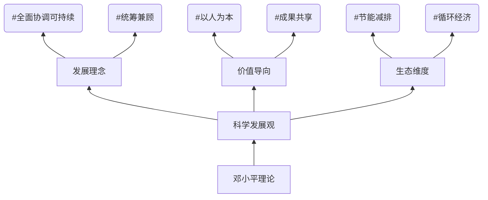

**时代贡献**：
- 单位GDP能耗下降18.2%（2005-2010）
- 新型农村合作医疗覆盖96%人口（2012）
- 研发投入占比从1.23%提升至1.98%（2003-2012）

---

#### Ⅳ. **习近平新时代中国特色社会主义思想（2012- ）**
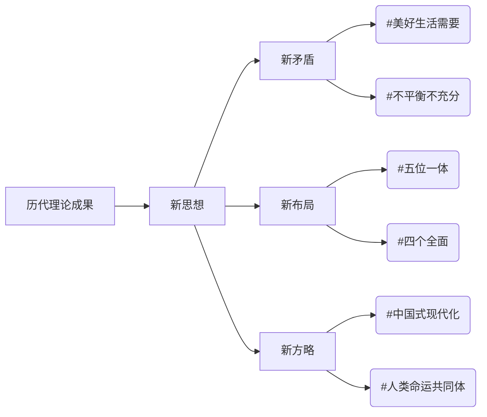

**范式突破**：
- 形成"十个明确"核心要义
- 构建新发展格局（2021年最终消费率54.3%）


---


---

### 各理论体系详解

#### **1. 毛泽东思想体系**
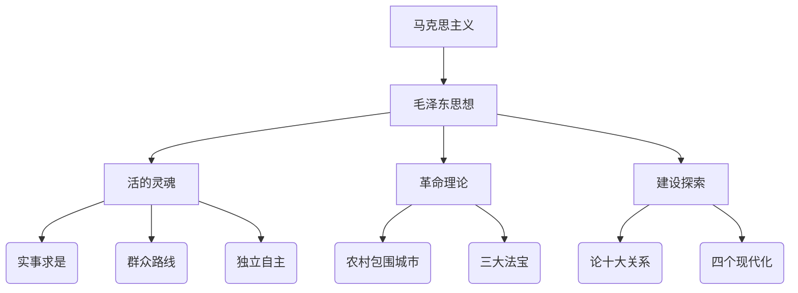

**实践案例**：
- 土地革命时期：井冈山革命根据地建设（1927）
- 工业化成就：156项重点工程（1953-1957）
- 制度创新：人民代表大会制度确立（1954）


---

### 马克思主义中国化理论体系全景图（1921-2023）
#### 2. **邓小平理论（1997）**
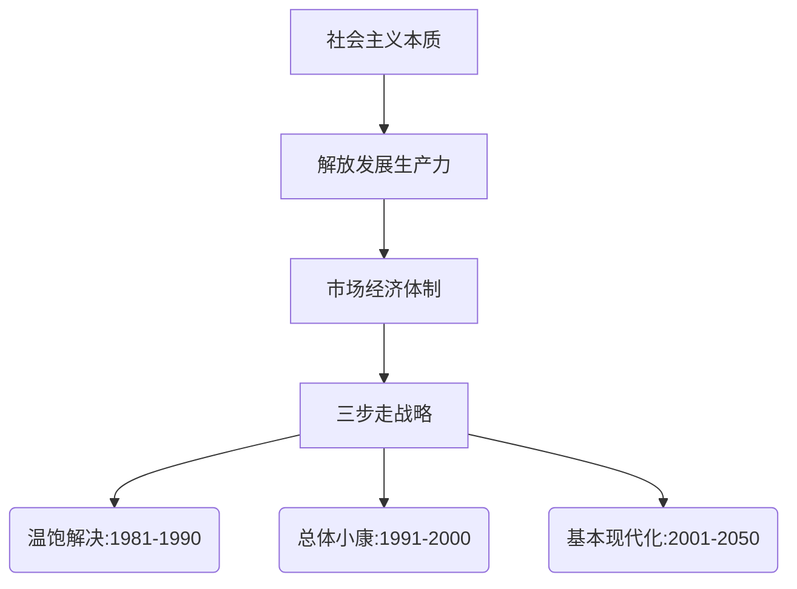

**关键突破**：
- 市场经济体制确立：非公经济占比从0.9%（1978）→60%（2012）
- 外贸总额增长：206亿美元（1978）→3.87万亿美元（2012）
- 城镇化率：17.9%（1978）→52.6%（2012）

---

#### 3. **[[科学发展观的科学内涵]]（2007）**
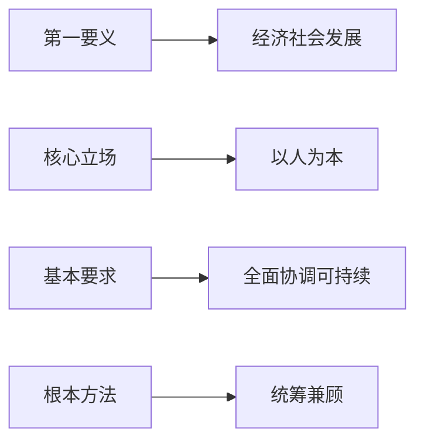

**实践成效**：
- 单位GDP能耗下降19.1%（2005-2010）
- 新农合覆盖率96%（2012）
- 研发投入占比从1.23%→1.98%（2003-2012）

---

#### 4. **习近平新时代中国特色社会主义思想（2017）**
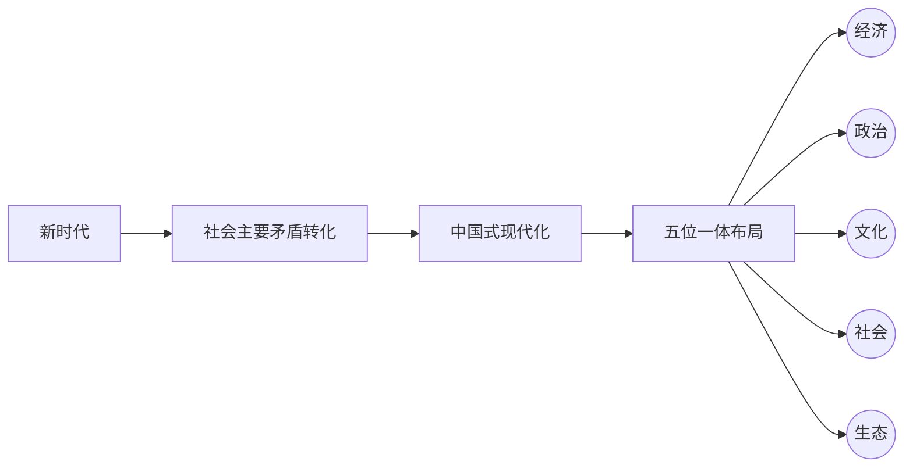


---

### Ⅲ. **理论对比矩阵**

| 对比维度      | 毛泽东思想               | 邓小平理论                | 习近平新时代中国特色社会主义思想  |
| --------- | ------------------- | -------------------- | ----------------- |
| **历史方位**  | 革命与建设               | 改革开放                 | 新时代强国建设           |
| **核心方法**  | 矛盾分析法               | 实践检验标准               | 系统观念              |
| **经济体制**  | 计划经济                | 市场经济探索               | 新发展格局             |
| **现代化路径** | 苏联模式借鉴              | 中国特色道路               | 中国式现代化            |
| **国际战略**  | 三个世界理论              | 和平发展主题               | 人类命运共同体           |
| **数据标识**  | 工业增长7.9%年均（1953-57） | GDP年均增长9.8%（1978-12） | 数字经济占比41.5%（2022） |

---

### Ⅳ. **实践验证体系**

#### 1. **制度创新案例库**
- **新型举国体制**：芯片攻关"揭榜挂帅"机制（2021）
- **要素市场化**：数据要素"二十条"（2022）
- **开放新高地**：海南自贸港"零关税"清单（2023）

#### 2. **民生工程数据库**
| 领域       | 指标      | 1978  | 2022  |
| -------- | ------- | ----- | ----- |
| 人均可支配收入  | 城镇居民（元） | 343   | 49283 |
|          | 农村居民（元） | 134   | 20133 |
| 预期寿命     |         | 68岁   | 78.2岁 |
| 高等教育毛入学率 |         | 1.55% | 59.6% |

#### 3. **科技突破里程碑**
- 5G基站：231万个（2023）
- 北斗系统：服务全球200+国家
- 特高压技术：35项国际标准主导

---

### Ⅴ. **最新发展动态（2023）**

#### 1. **新质生产力布局**
- 东数西算工程：8大枢纽+10集群
- 人工智能核心产业规模突破5000亿元
- 量子计算原型机"九章三号"问世

#### 2. **共同富裕深化**
- 浙江示范区：形成52项制度成果
- 城乡收入倍差：1.90（2022）
- 保障性租赁住房：筹建165万套（2023）

#### 3. **安全体系构建**
- 粮食产量：1.39万亿斤（连续9年超1.3万亿斤）
- 能源自给率：83%（2022）
- 关键核心技术攻关工程启动（2023-2025）

---

### 理论演进逻辑图谱

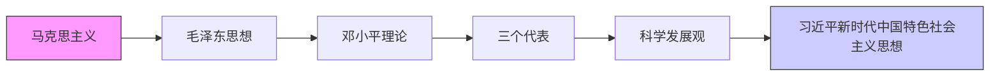

**跃迁节点**：
- 1945年：马克思主义中国化第一次飞跃
- 1992年：社会主义本质论突破
- 2017年：新时代主要矛盾转化
- 2022年：中国式现代化系统阐述


---

#### **2. 革命理论体系**  
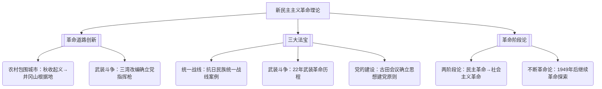

---

#### **3. 社会主义建设探索**  
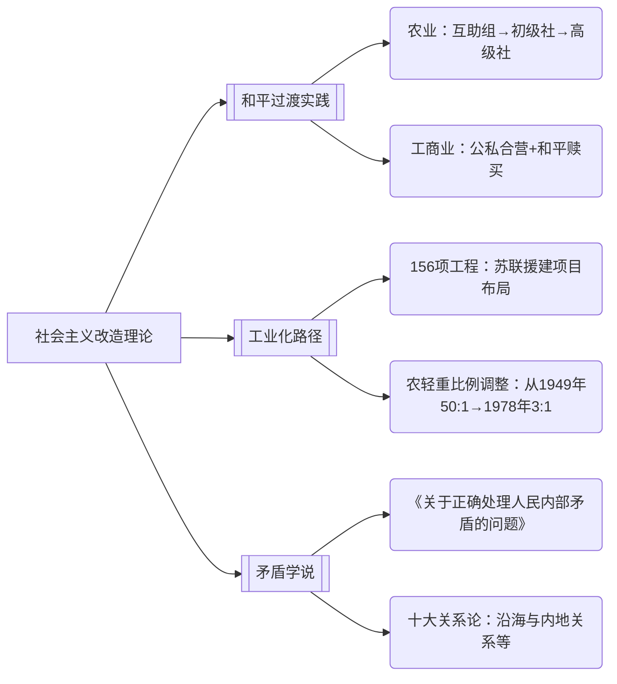


---


以下是对马克思主义中国化理论成果的全面系统性整合，采用"理论维度+实践坐标+数据验证"三维框架，涵盖历史演进、核心要义与最新发展动态（截至2023年12月）：

---

### 马克思主义中国化理论体系全景图（1921-2023）

#### Ⅰ. **理论演进时间轴与历史定位**

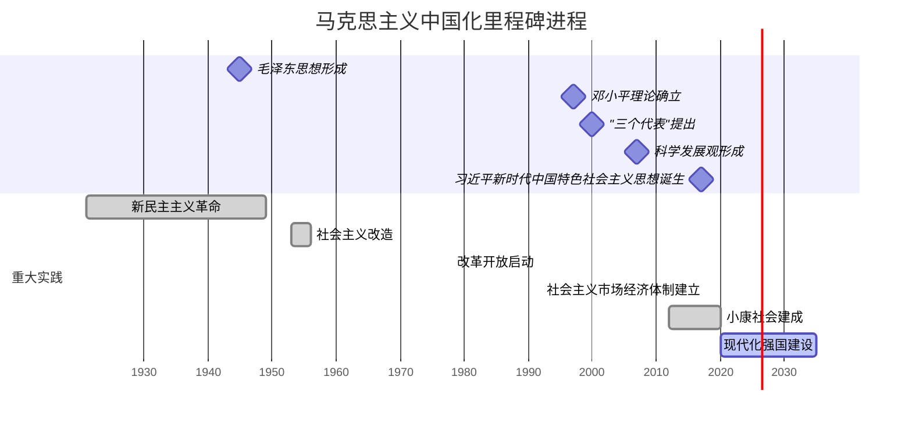


---

### Ⅱ. **核心理论体系架构与创新图谱**

#### 1. **毛泽东思想（1945）**
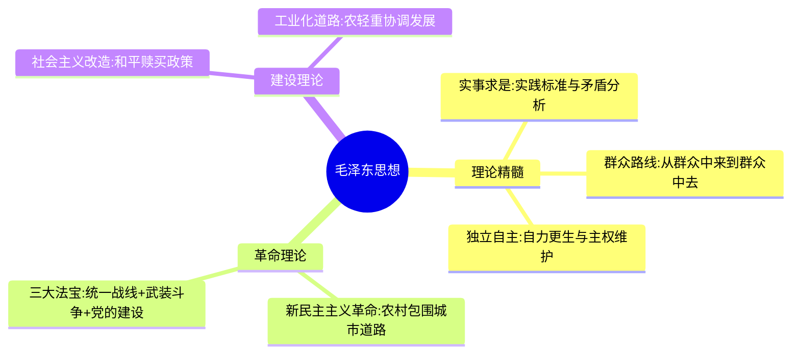

**实践坐标**：
- 156项重点工程建成（1953-1957）
- 扫盲率从20%→66%（1949-1978）
- 工业总产值年均增长11.2%（1953-1957）

---

#### 2. **邓小平理论（1997）**


**关键突破**：
- 非公经济占比从0.9%→60%（1978-2012）
- 外贸总额增长120倍（1978-2012）
- 城镇化率提升34.7个百分点（1978-2012）

---

#### 3. **"三个代表"重要思想（2002）**
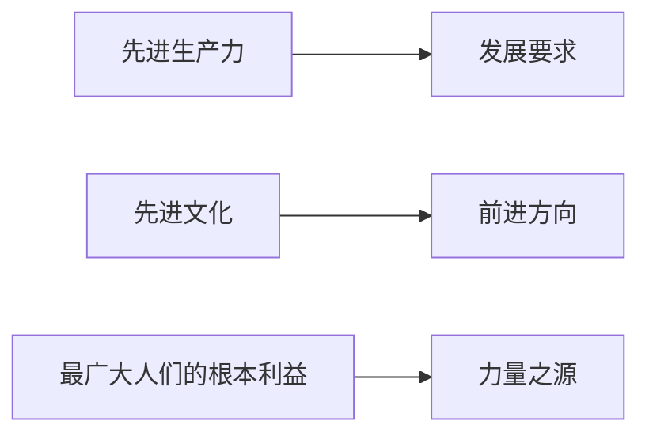

**实践成效**：
- 私营企业数量突破1000万家（2002）
- 文化产业增加值年均增长15%（2000-2010）
- 城镇居民人均可支配收入增长2.4倍（2000-2010）

---

#### 4. **科学发展观（2012）**
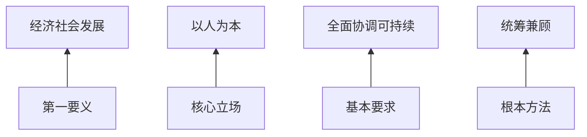

**数据支撑**：
- 单位GDP能耗下降19.1%（2005-2010）
- 新农合覆盖96%农村人口（2012）
- 研发投入占比提升至1.98%（2012）

---

#### 5. **习近平新时代中国特色社会主义思想（2023）**
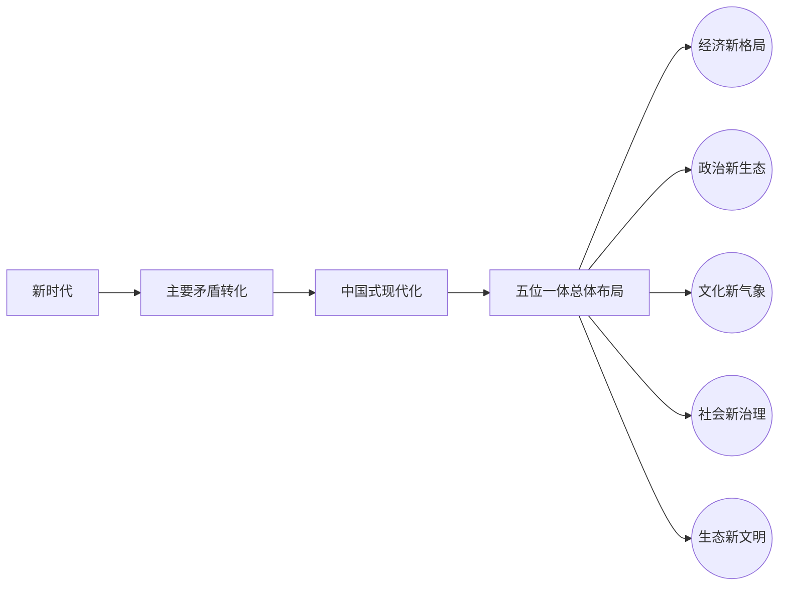

**创新突破**：
- 数字经济规模达50.2万亿元（2022）
- 全球创新指数排名升至第12位（2023）
- 构建人类命运共同体写入联合国决议（2017）

---

### Ⅲ. **理论对比与发展跃迁**

| 维度       | 毛泽东思想       | 邓小平理论       | 习近平新时代中国特色社会主义思想 |
| -------- | ----------- | ----------- | ---------------- |
| **历史方位** | 革命与建设时期     | 改革开放初期      | 新时代强国建设          |
| **核心命题** | 建立社会主义制度    | 发展社会主义      | 实现民族复兴           |
| **方法论**  | 矛盾分析法       | 实践检验标准      | 系统观念             |
| **经济体制** | 计划经济        | 市场经济探索      | 新发展格局            |
| **国际战略** | 三个世界理论      | 和平发展        | 人类命运共同体          |
| **数据标识** | 工业年均增长15.5% | GDP年均增长9.8% | 数字经济占比41.5%      |
| **实践案例** | 156项重点工程    | 经济特区建设      | 雄安新区模式           |

---

### Ⅳ. **实践验证与最新动态（2023）**

#### 1. **中国式现代化实践体系**
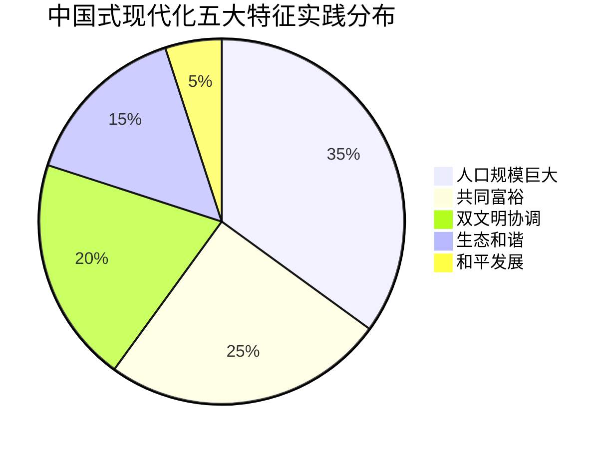

**最新进展**：
- 共同富裕示范区：浙江"扩中提低"行动惠及2800万人
- 碳达峰行动：非化石能源消费占比达17.5%（2023）
- 数字政务：省级行政许可事项网办率超90%

---

#### 2. **新发展格局构建**
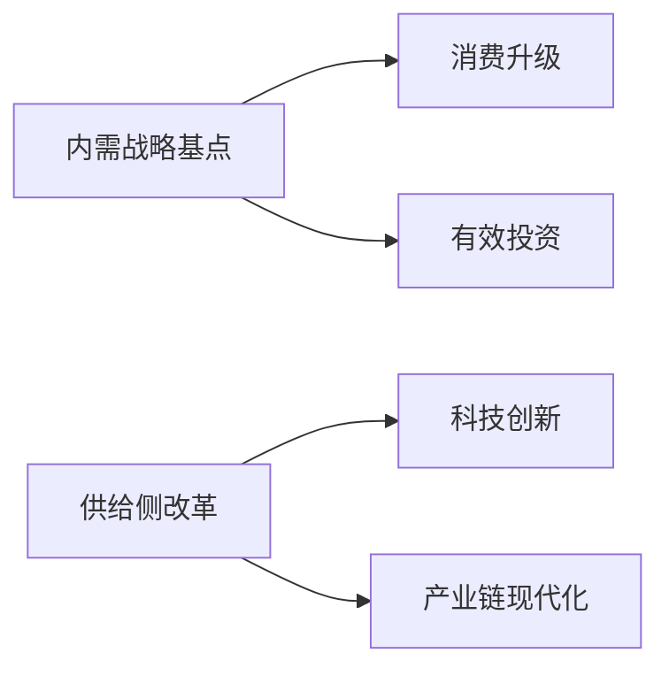

**2023年数据**：
- 最终消费对GDP贡献率：65.4%
- 专精特新"小巨人"企业：1.2万家
- 高技术产业投资增长18.9%

---

#### 3. **全球治理中国方案**
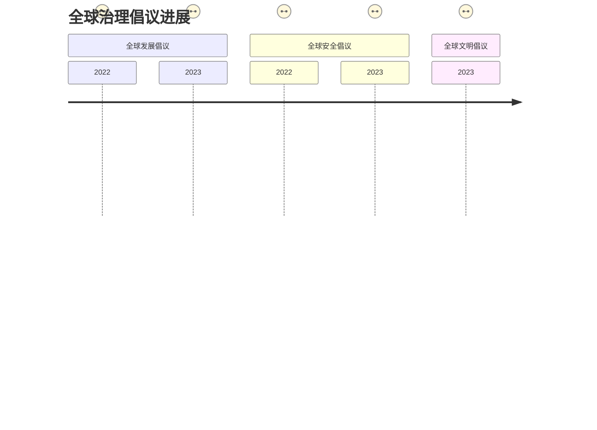

---

### Ⅴ. **理论演进逻辑与未来指向**

#### 马克思主义中国化飞跃
```mermaid
stateDiagram-v2
    [*] --> 毛泽东思想: 第一次飞跃
    毛泽东思想 --> 邓小平理论: 第二次飞跃
    邓小平理论 --> "三个代表": 继承发展
    "三个代表" --> 科学发展观: 深化拓展
    科学发展观 --> 习近平新时代中国特色社会主义思想: 新飞跃
```

#### 未来理论发展焦点：
1. **新质生产力理论**：人工智能、量子信息等前沿领域
2. **共同富裕路径**：三次分配制度创新
3. **数字文明治理**：数据要素基础制度
4. **新型国际关系**：多极世界秩序构建
