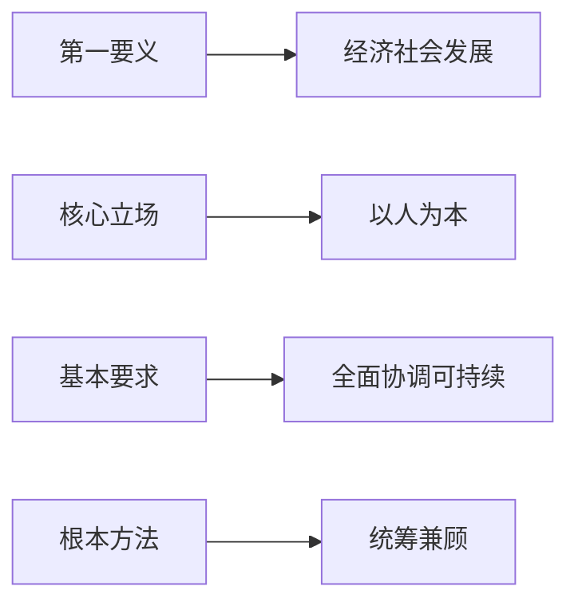

1. 推动经济社会发展是科学发展观的第一要义。
	1. 发展是解决中国一切问题的总钥匙。是在当代中国坚持发展是硬道理的本质要求是坚持持科学发展。
	2. 坚持科学发展必须加快转变经济发展方式；推动推动科学技术跨越式发展，培养高素质创新人才。同时还要善于抓住和用好机遇。
2. 以人为本是科学发展观的核心立场。
		1. 坚持以人为本，就是要坚持发展为了人民，始终把最广大人民的根本利益放在第一位。
		2. 坚持以人为本，就是要坚持发展依靠人民，从人民群众的伟大创造中汲取智慧和力量。
		3. 坚持以人为本，就是要坚持发展成果由人民共享，着力提高人民物质文化生活水平。
		4. 坚持以人为本，最终是为了实现人的全面发展。
3. 全面协调可持续是科学发展观的基本要求。
		1. 坚持全面发展就是要正确认识和把握经济建设、政治建设、文化建设、社会建设和生态文明建设。是相互联系的有机统一体。
		2. 坚持协调发展，就是要正确处理经济社会发展中的重大关系，促进现代化建设各方面的协调发展。
		3. 坚持可持续发展就是要坚定走生产发展、生活富裕、生态良好的文明发展道路。
4. 统筹兼顾是科学发展观的根本方法。统筹兼顾是正确处理经济社会发展中重大关系的方针原则。
		1. 坚持统筹兼顾，要正确认识和处理中国特色社会主义事业中的重大关系，认真对待各方面的发展需要，正确反映兼顾各阶层，各群体的利益要求。
		2. 坚持统筹兼顾，要牢牢把握统筹兼顾的科学思想方法，不断增强统筹兼顾的本领，更好地推动科学发展。
		3. 坚持统筹兼顾，要求我们既要立足当前，又要着眼长远，做到兼顾各方综合平衡，注重发展的协调性和稳定性。

**内在逻辑**：
发展（目标） → 以人为本（价值） → 全面协调可持续（路径） → 统筹兼顾（方法）  

第一要义：发展是硬道理

问题总钥匙 → 科学发展的本质 → 转变发展方式 → 科技人才驱动  
**终极目标**：
物质富裕 → 精神充实 → 生态宜居 → 人的全面发展  

基本要求：全面协调可持续
**三维度解析**：

| ​**维度**   | ​**重点领域**              | ​**矛盾处理**    |
| --------- | ---------------------- | ------------ |
| ​**全面性**  | 五位一体建设（经济/政治/文化/社会/生态） | 破除GDP中心主义    |
| ​**协调性**  | 城乡/区域/产业/供需平衡          | 实施西部大开发/乡村振兴 |
| ​**可持续性** | 资源节约型社会建设              | 碳达峰碳中和路径     |

**记忆口诀**：​**"五位一体三协调，绿水青山可持续"**

根本方法：统筹兼顾

**三大方法论**：

1. ​**空间统筹**：
    
    - 东中西部协同发展
    - 新型城镇化与乡村振兴结合
2. ​**时间统筹**：
    
    - 当前利益与长远规划衔接
    - 代际公平（如生态文明建设）
3. ​**利益统筹**：
    
    - 政府-市场-社会三方协同
    - 劳资关系/贫富差距调节

        [发展是第一要义]  
           ↓  
[以人为本] ← 动力与目的 → [全面协调可持续]  
           ↓  
      [统筹兼顾方法论]  
           │  
           ├→ 空间维度：区域协调  
           ├→ 时间维度：代际公平  
           └→ 利益维度：社会和谐  

#### **八、当代启示**

4. ​**新发展理念源头**：创新/协调/绿色/开放/共享的理念雏形
5. ​**双碳战略基础**：可持续发展观的深化延伸
6. ​**共同富裕路径**：统筹效率与公平的方法论指导

	1. 推动经济社会发展是科学发展观的第一要义。发展是解决中国一切问题的总钥匙。在当代中国，坚持发展是硬道理的本质要求就是坚持科学发展。
	2. 以人为本是科学发展观的核心立场。集中体现了我们党全心全意为人民服务的根本宗旨和推动经济社会发展的根本目的。
	3. 全面协调可持续是科学发展观的基本要求。推动“五位一体”总体布局全面发展，各个领域协调推进，建设生态文明，推动可持续。
	4. 统筹兼顾是科学发展观的根本办法。统筹兼顾是正确处理经济社会发展中重大关系的方针原则。

**Tag：**  
#科学发展观 #经济社会发展 

#以人为本

#全面协调可持续 #五位一体 #生态文明

#统筹兼顾 #中国特色社会主义 #党的宗旨 #可持续发展

**总结：**  
科学发展观是中国特色社会主义理论体系的重要组成部分，其核心内容包括：  
7. **第一要义**：推动经济社会发展，坚持发展是硬道理，科学发展是解决中国一切问题的关键。  
8. **核心立场**：以人为本，体现党的根本宗旨和经济社会发展的根本目的。  
9. **基本要求**：全面协调可持续，推动“五位一体”总体布局，建设生态文明，实现可持续发展。  
10. **根本方法**：统筹兼顾，正确处理经济社会发展中的重大关系。  

科学发展观为实现经济社会全面进步提供了科学指导。

### 科学发展观

- **第一要义**：推动经济社会发展
    
- **核心立场**：以人为本
    
- **基本要求**：全面协调可持续
    
- **根本方法**：统筹兼顾

全面指的是五位一体。