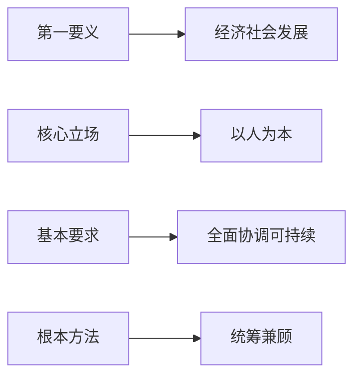

1. 推动经济社会发展是科学发展观的第一要义。发展是解决中国一切问题的总钥匙。在当代中国，坚持发展是硬道理的本质要求就是坚持科学发展。

2. 以人为本是科学发展观的核心立场。集中体现了我们党全心全意为人民服务的根本宗旨和推动经济社会发展的根本目的。

3. 全面协调可持续是科学发展观的基本要求。推动“五位一体”总体布局全面发展，各个领域协调推进，建设生态文明，推动可持续。

4. 统筹兼顾是科学发展观的根本办法。统筹兼顾是正确处理经济社会发展中重大关系的方针原则。

**Tag：**  
#科学发展观 #经济社会发展 

#以人为本

#全面协调可持续 #五位一体 #生态文明

#统筹兼顾 #中国特色社会主义 #党的宗旨 #可持续发展

**总结：**  
科学发展观是中国特色社会主义理论体系的重要组成部分，其核心内容包括：  
1. **第一要义**：推动经济社会发展，坚持发展是硬道理，科学发展是解决中国一切问题的关键。  
2. **核心立场**：以人为本，体现党的根本宗旨和经济社会发展的根本目的。  
3. **基本要求**：全面协调可持续，推动“五位一体”总体布局，建设生态文明，实现可持续发展。  
4. **根本方法**：统筹兼顾，正确处理经济社会发展中的重大关系。  

科学发展观为实现经济社会全面进步提供了科学指导。

### 科学发展观

- **第一要义**：推动经济社会发展
    
- **核心立场**：以人为本
    
- **基本要求**：全面协调可持续
    
- **根本方法**：统筹兼顾

全面指的是五位一体。